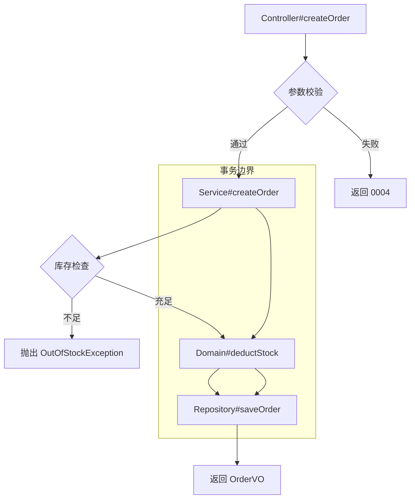
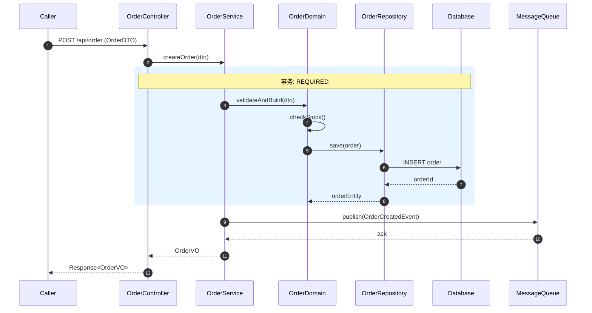
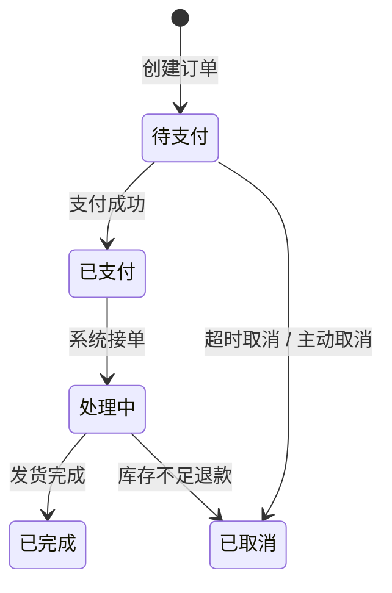

## 用户输入

```text
$ARGUMENTS
```

用户可提供：服务名、模块名、Controller/Service/Repository 代码路径、数据库 Schema/DDL 路径、Mapper XML 路径、输出文件名。

## 目标

- 根据后端代码（Controller、Service、Domain、Repository、Mapper、SQL），**按本模板生成完整设计文档**。
- **每个方法单独成块**（独立四级标题），块内子节顺序、表格列与模板**一致**；缺信息时标注「待补充」并列入待确认项，**不得静默省略必选子节**。
- **按模块组织**：文档章节体现 `模块 -> Controller -> 方法` 三级结构，便于与 `01-接口文档.md` 交叉引用。
- 设计文档聚焦**内部实现细节**：业务逻辑、流程编排、数据流转、状态机、事务边界、异常处理、性能与稳定性设计。

### 与接口文档衔接（推荐）

- **输入优先级**：**P0** 已实现代码（Controller、Service、Repository、Mapper、SQL、ORM 实体）；**P1** 对应模块 `{功能点}_业务需求文档.md` 中的业务规则与状态流转说明；**P2** `功能清单.md` 中业务流程描述。
- **交叉引用**：每个方法块须引用对应的接口文档块（如「接口契约见 `01-接口文档.md ## x.x.x {Controller#method}`」）。
- **分批策略**：**按模块或按业务域** 合订（如 `{模块名}_设计文档.md`），便于审查及与 BRD 目录对照。
- **追溯**：文档级「约定与范围」或修订记录中可注明 **覆盖的 BRD 路径 / 功能清单章节**。

---

## 文档级结构（合订多模块时）

在**第一个具体方法块之前**，必须包含：

| 块 | 内容 |
|----|------|
| 标题 | `# {服务名} 设计文档` |
| 修订记录 | 版本、日期、作者、变更摘要（可选） |
| 服务业务域概览 | 服务职责、核心业务能力、技术栈、关键依赖 |
| 模块业务地图 | 模块清单、职责简述、模块间依赖关系图（文字描述或 Mermaid） |
| **方法索引** | 表格：**序号、模块、Controller#method、中文名、涉及表、事务、异步调用**（便于跳转） |

---

## 模块章节结构（顺序固定）

每个模块使用**一个二级标题**作为边界：

```markdown
## {序号}. {模块名}

> **模块职责**：一句话描述该模块的业务边界与核心实体  
> **边界说明**：与相邻模块的职责分界  
> **关键实体**：该模块涉及的核心领域实体

### {序号}.1 模块职责与边界

### {序号}.2 方法级业务链路

#### {序号}.2.n {Controller#method} — {方法中文名称}

##### 1. 方法标识

##### 2. 主链路（流程图）

##### 3. 时序图

##### 4. 分支链路

##### 5. 异常链路

##### 6. 业务规则分类

##### 7. 枚举与状态机

##### 8. 数据库与表影响

##### 9. 下游依赖与稳定性

##### 10. 方法链路追踪（调用链明细）

### {序号}.3 模块规则清单汇总

### {序号}.4 模块枚举与状态机总表

### {序号}.5 模块数据库表影响总表
```

以上 **10 个子节标题建议字面一致**（允许前缀编号如「1. 方法标识」，但**语义与顺序**须一致）。

---

### 子节 1：方法标识（生成规则）

必须覆盖：

| 子项 | 说明 |
|------|------|
| 模块名 | 所属模块 |
| Controller | 类全名或简名 |
| 方法名 | Java/Go 方法名 |
| 路由 | HTTP Method + Path |
| 接口文档引用 | 对应 `01-接口文档.md` 中的章节锚点 |
| 业务说明 | **一句话**该方法在业务上的职责 |

---

### 子节 2：主链路（流程图）（生成规则）

**必须**使用 Mermaid 流程图（`flowchart TD` 或 `flowchart LR`）描述方法的主干执行流程。

要求：
- 节点覆盖：输入校验 -> 权限校验 -> 业务编排 -> 数据操作 -> 对外调用 -> 返回组装
- 每个节点标注**代码位置**（类名#方法名）
- 条件判断用菱形节点，标注判断条件
- 循环/批量操作用子图包裹
- 事务边界用虚线框标注（`TX` 开始 / `TX` 结束 / `TX` 回滚）

示例：

```markdown

```

---

### 子节 3：时序图（生成规则）

**必须**使用 Mermaid 时序图（`sequenceDiagram`）描述方法执行过程中的对象交互。

要求：
- 参与者（Participant）须包含：调用方、Controller、Service、Domain、Repository、DB、外部服务/MQ/缓存
- 消息须标注**方法名**和**关键参数**
- 异步调用用虚线箭头（`-->>`）
- 事务边界用 `rect` 包裹并标注传播行为（REQUIRED/REQUIRES_NEW/NESTED）
- 异常返回用红色标注（`Note over X: Exception`）
- 自调用（Self-call）须显式展示

示例：

```markdown

```

---

### 子节 4：分支链路（生成规则）

列出方法中所有**条件分支**（if/switch/策略模式等）：

| 序号 | 分支条件 | 触发阈值/条件表达式 | 分支动作 | 分支返回 | 代码位置 |
|------|----------|---------------------|----------|----------|----------|
| 1 | 库存不足 | `stock < quantity` | 抛出异常 | 错误码 1001 | Service#checkStock |
| 2 | 新用户优惠 | `userType == NEW` | 应用折扣 | 折扣后金额 | Domain#calculatePrice |

要求：
- 每个分支须标注**代码位置**（类名#方法名 或 行号范围）
- 复杂分支条件须展开为子表或伪代码
- 策略模式实现须列出全部策略实现类

---

### 子节 5：异常链路（生成规则）

列出方法中所有**异常处理路径**：

| 异常类型 | 抛出点 | 捕获点 | 转换规则 | 返回码 / HTTP 状态 | 日志/告警 | 代码位置 |
|----------|--------|--------|----------|-------------------|-----------|----------|
| ParamInvalidException | Controller | Controller | 直接转换 | 0004 / 400 | info | Controller#handle |
| OutOfStockException | Domain | Service | 包装为 BizException | 1001 / 200 | warn | Service#createOrder |
| DBTimeoutException | Repository | Service | 重试后抛出自定义异常 | 0001 / 500 | error+告警 | Repository#save |

要求：
- 须区分**业务异常**（预期内）与**系统异常**（预期外）
- 须标注异常是否触发**事务回滚**
- 须标注异常是否触发**降级/兜底逻辑**
- 全局异常处理器（@ControllerAdvice / GlobalExceptionHandler）须单独说明

---

### 子节 6：业务规则分类（生成规则）

将方法涉及的业务规则按以下**强制分类**汇总：

| 规则类别 | 规则说明 | 触发条件 | 校验/执行位置 | 失败处理 | 证据锚点 |
|----------|----------|----------|---------------|----------|----------|
| 准入规则 | 认证/授权/租户/组织校验 | 每次请求 | Controller/Interceptor | 返回 0002/0003 | file+symbol |
| 校验规则 | 格式、范围、交叉字段校验 | 入参接收后 | Controller/Service | 返回 0004 | file+symbol |
| 流转规则 | 状态机、前后置条件 | 业务操作前 | Domain/Service | 抛出状态异常 | file+symbol |
| 并发规则 | 锁、版本、去重 | 并发场景 | Service/Repository | 重试或失败 | file+symbol |
| 幂等规则 | 幂等键、窗口期 | 重复请求 | Service/Interceptor | 返回缓存结果 | file+symbol |
| 时效规则 | 超时、有效期 | 定时或实时 | Service/Domain | 抛出超时异常 | file+symbol |
| 审计规则 | 谁、何时、做了什么 | 关键操作 | AOP/Service | 记录审计日志 | file+symbol |
| 补偿规则 | 失败回滚、补偿动作 | 事务失败/异步失败 | Service/MQ 消费者 | 重试或人工介入 | file+symbol |

要求：
- 每个规则须附**证据锚点**（file_path + symbol）
- 规则描述须具体，禁止泛泛而谈（如「做了校验」应写清「校验了xx字段的yy规则」）
- 涉及多个方法的同类规则可在「模块规则清单汇总」中统一展开

---

### 子节 7：枚举与状态机（生成规则）

#### 7.1 枚举清单

| 枚举名 | 所属类 | 用途 | 全部值与含义 | 代码位置 |
|--------|--------|------|-------------|----------|
| OrderStatus | OrderStatusEnum | 订单状态 | 0-待支付, 1-已支付, 2-处理中, 3-已完成, 4-已取消 | enums/OrderStatus.java |

#### 7.2 状态机（如涉及）

**必须**使用 Mermaid 状态图（`stateDiagram-v2`）或表格描述状态流转：

```markdown

```

状态机表格（补充）：

| 当前状态 | 允许下一状态 | 触发事件 | 守卫条件 | 失败回滚策略 | 代码位置 |
|----------|-------------|----------|----------|-------------|----------|
| 待支付 | 已支付 | PAY_SUCCESS | 金额匹配 | 无 | PaymentService#callback |
| 待支付 | 已取消 | TIMEOUT / CANCEL | 超时或用户主动 | 无 | OrderService#cancel |

要求：
- 每个状态机包含：**状态集合、允许流转矩阵、触发事件、守卫条件、失败回滚策略**
- 状态流转必须与代码中的条件判断一致，不得臆测
- 涉及工作流引擎（Activiti/Camunda等）时须说明流程定义文件位置

---

### 子节 8：数据库与表影响（生成规则）

#### 8.1 方法级表影响

| database | schema | table | operation | where_keys | write_fields | join_tables | index_or_unique_dependency | transaction_scope | 代码位置 |
|----------|--------|-------|-----------|------------|--------------|-------------|---------------------------|-------------------|----------|
| order_db | public | t_order | INSERT | | order_no, user_id, amount, status, create_time | | uk_order_no | TX: Service#createOrder | OrderRepository#save |
| order_db | public | t_stock | UPDATE | sku_id | quantity, version | | uk_sku_id + version(乐观锁) | TX: 同上 | StockRepository#deduct |

#### 8.2 SQL 明细（关键操作）

对于复杂查询、批量更新、无 where 更新等高风险操作，须展开 SQL 或伪 SQL：

```sql
-- 库存扣减（乐观锁）
UPDATE t_stock 
SET quantity = quantity - #{deductQty}, version = version + 1
WHERE sku_id = #{skuId} AND version = #{version} AND quantity >= #{deductQty}
```

#### 8.3 表级汇总（按模块）

| 表名 | 业务用途 | 上游接口（读写方法） | 核心字段语义 | 逻辑删除字段 | 乐观锁字段 | 高风险操作 |
|------|----------|---------------------|-------------|-------------|-----------|-----------|
| t_order | 订单主表 | OrderController#createOrder(R/W), OrderController#queryOrder(R) | order_no: 业务单号, status: 订单状态 | is_deleted | version | 无 |
| t_stock | 库存表 | OrderController#createOrder(W), StockController#queryStock(R) | quantity: 可用库存, version: 乐观锁版本 | is_deleted | version | 批量扣减 |

要求：
- 数据来源：ORM 注解/实体映射、Mapper XML / 原生 SQL、Repository 命名与查询构造器、Flyway/Liquibase/DDL 脚本
- 多库、多租户场景须标注数据源配置
- 无 SQL/ORM 证据时写 `UNKNOWN_RUNTIME`，不得臆测表关系

---

### 子节 9：下游依赖与稳定性（生成规则）

| 依赖类型 | 依赖目标 | 调用目的 | 超时设置 | 重试策略 | 熔断/降级 | 补偿机制 | 代码位置 |
|----------|----------|----------|----------|----------|-----------|----------|----------|
| HTTP | PaymentService | 创建支付单 | 3s | 重试2次, 间隔1s | Hystrix, 降级返回本地缓存 | MQ 异步对账 | PaymentClient#create |
| RPC | UserService | 查询用户信息 | 1s | 不重试 | 无 | 无 | UserClient#getById |
| MQ | order_topic | 发送订单创建事件 | 5s | 生产者重试3次 | 无 | 定时任务补偿 | MQProducer#send |
| Cache | Redis | 缓存订单详情 | 100ms | 无 | 降级查DB | 无 | CacheManager#get |
| DB | order_db | 订单持久化 | 连接池配置 | 无 | 无 | 事务回滚 | Repository#save |

要求：
- 每个依赖须标注**失败后的处理策略**（重试、降级、熔断、补偿）
- 异步调用须标注**消息可靠性**（投递确认、死信队列、消费幂等）
- 缓存须标注**读写策略**（Cache-Aside/Write-Through/Write-Behind）与**失效策略**

---

### 子节 10：方法链路追踪（调用链明细）（生成规则）

提供**文本级调用链**，便于快速定位代码：

```text
主链路：
  OrderController#createOrder(String userId, OrderDTO dto)
    └─> OrderService#createOrder(OrderDTO dto) [TX: REQUIRED]
          ├─> OrderDomain#validateAndBuild(OrderDTO) [校验规则]
          │     └─> StockService#checkStock(String skuId, int qty) [RPC: 1s超时]
          ├─> OrderDomain#calculatePrice(OrderDTO) [分支: 新用户优惠]
          ├─> OrderRepository#save(OrderEntity) [DB: INSERT t_order]
          │     └─> StockRepository#deduct(String skuId, int qty) [DB: UPDATE t_stock, 乐观锁]
          └─> MQProducer#send(OrderCreatedEvent) [MQ: order_topic, 异步]
                └─> (异步) OrderEventConsumer#onCreated(Event) [消费端]
                      └─> NotificationService#sendSms(String phone) [HTTP: 3s超时]

异常链：
  OutOfStockException @ StockService#checkStock
    └─> 捕获于 OrderService#createOrder
          └─> 转换为 BizException(1001, "库存不足")
                └─> 事务回滚
```

要求：
- 每个节点须标注：**类型**（Controller/Service/Domain/Repository/DB/External）、**关键操作**、**特殊标记**（TX/RPC/MQ/Cache/分支/异常）
- 分支链路用缩进 + 条件注释
- 异常链路用异常类型 + 传播路径

---

## 横切能力覆盖清单

以下横切能力必须在文档中至少出现一次（有则写，无则 N/A）：

| 能力维度 | 检查点 | 文档位置 |
|----------|--------|----------|
| 认证与授权 | JWT、RBAC、ABAC 实现方式 | 准入规则 / 模块规则清单 |
| 租户隔离与数据权限 | 租户字段、数据权限过滤逻辑 | 数据库与表影响 / 准入规则 |
| 限流与防刷 | 限流规则、防刷策略 | 非功能特征 / 模块规则清单 |
| 幂等与防重 | 幂等键、窗口期、去重逻辑 | 幂等规则 / 下游依赖 |
| 事务传播与最终一致性 | 事务边界、传播行为、补偿机制 | 主链路 / 异常链路 |
| 缓存策略 | 旁路/写透/双删、失效策略 | 下游依赖与稳定性 |
| 消息可靠性 | 投递确认、重试、死信、消费幂等 | 下游依赖与稳定性 |
| 异常分层 | 业务异常/系统异常定义与处理 | 异常链路 |
| 降级熔断 | 本地兜底/远程兜底、熔断条件 | 下游依赖与稳定性 |
| 可观测性 | 日志字段标准、traceId、指标埋点 | 方法链路 / 异常链路 |
| 安全 | 脱敏、加密、签名、防重放 | 业务规则分类 / 模块规则清单 |
| 配置治理 | 动态开关、灰度、阈值配置 | 分支链路 / 模块规则清单 |
| 批处理/定时任务 | 批处理逻辑、定时任务触发 | 模块规则清单 |
| 并发控制 | 锁（分布式/本地）、乐观锁、唯一约束 | 并发规则 / 数据库与表影响 |
| 版本兼容 | 接口版本、字段兼容策略 | 方法标识 / 分支链路 |

---

## 证据与可追溯性规则

关键结论必须附证据锚点：
- `file_path`：代码文件路径
- `symbol`：类名、方法名、字段名
- `evidence_type`：route / validation / auth / sql / transaction / enum / cache / mq / rpc / exception / state_machine
- `confidence`：EXTRACTED（直接从代码提取）/ INFERRED（合理推断）/ AMBIGUOUS（存在歧义）

禁止：
- 无证据推断
- 只给结论不给来源

---

## 严格事实模式（Strict Fact Mode，强制开启）

### 基本原则（强制）

- 只允许依据可验证代码证据输出业务结论。
- 未观察到证据的内容，必须输出 `UNKNOWN_RUNTIME`，不得补全。
- 主文档（设计文档）默认只收录 `EXTRACTED` 结论。
- `INFERRED` 与 `AMBIGUOUS` 仅允许写入「候选/待确认」区块，不得混入主结论。

### 输出约束（强制）

每条方法级关键结论必须满足：
- 至少 1 个证据锚点：`file_path + symbol + evidence_type`
- 至少 1 条证据摘要：说明该证据支持了什么结论
- 置信度明确：`EXTRACTED | INFERRED | AMBIGUOUS`

若不满足则：
- 该结论标记为 `INVALID_NO_EVIDENCE`
- 不得进入主文档正文
- 必须进入 `quality-report.json` 的阻断项

### 防发散禁令（强制）

- 禁止使用「通常/一般/大概率/推测」等措辞代替证据。
- 禁止推断外部服务内部逻辑；只能描述「本服务可见调用行为」。
- 禁止将命名相似直接视为业务等价（需代码链路证据）。
- 禁止根据历史经验补全状态机、补偿逻辑、权限规则。
- 禁止在无 SQL/ORM 证据时写数据库表关系。

### 冲突与未知处理（强制）

- 证据冲突时不得自行合并，必须标记 `CONFLICT` 并并列展示。
- 运行时相关但静态不可见（配置中心、灰度开关、动态脚本）统一标记 `UNKNOWN_RUNTIME`。
- 对 `UNKNOWN_RUNTIME` 必须给出「缺失证据类型」和「建议补证路径」。

### 失败中断规则（强制）

任一方法出现以下情况，方法状态设为 `BLOCKED`：
- 找不到 Controller 到 Service 的可达链路证据
- 涉库逻辑存在但无法定位表或操作类型
- 状态机流转存在但无法定位守卫条件

`BLOCKED` 方法不得标记「返构完成」。

---

## 冲突与未知项模板（落地格式）

### 主文档中的未知项模板

```md
### UNKNOWN_RUNTIME
- 方法：<Controller#method>
- 未知点：<例如 动态开关控制的分支逻辑>
- 缺失证据：<配置中心键/运行时注入/环境变量来源>
- 建议补证：<配置仓库路径/运行日志字段/发布参数>
```

### 主文档中的冲突项模板

```md
### CONFLICT
- 方法：<Controller#method>
- 冲突主题：<例如 状态流转条件不一致>
- 证据 A：<file_path + symbol + 摘要>
- 证据 B：<file_path + symbol + 摘要>
- 处理策略：并列保留，待人工确认
```

### `quality-report.json` 最小字段

```json
{
  "strict_mode": true,
  "blocked_methods": [],
  "invalid_conclusions": [],
  "unknown_runtime_items": [],
  "conflict_items": [],
  "evidence_coverage": {
    "method_level": 0.0,
    "field_level": 0.0,
    "flow_chart_level": 0.0,
    "sequence_diagram_level": 0.0,
    "table_lineage_level": 0.0
  }
}
```

---

## 质量门禁

### 覆盖门禁

- Controller 方法覆盖率 = 100%
- 模块归类覆盖率 >= 98%
- 每个方法必须同时存在于接口文档与设计文档
- 业务规则分类完整率 >= 98%

### 链路门禁

- 每个方法至少 1 条完整主链到数据层或外部依赖
- 有分支必须有分支链路（表格或流程图）
- 有异常必须有异常链路（表格或时序图标注）
- 有事务必须标明事务边界和传播行为
- 涉状态机必须有状态图或流转矩阵

### 数据门禁

- 涉库方法必须标 database / schema / table / operation / 关键字段
- 使用枚举的方法必须标枚举值语义
- 使用缓存/MQ/RPC 的方法必须标调用目的与失败策略
- 高风险 SQL（批量更新、无 where 更新）必须标注并说明

### 图表门禁

- 每个方法必须包含**至少一个** Mermaid 图（流程图或时序图）
- 涉及状态流转的方法必须包含状态图
- 图表必须与代码逻辑一致，不得简化关键分支

### 严格事实门禁

- 主文档 `EXTRACTED` 结论占比 = 100%（正文部分）
- 每个方法至少一个证据锚点，否则该方法 `BLOCKED`
- `INVALID_NO_EVIDENCE` 数量必须为 0
- `CONFLICT` 与 `UNKNOWN_RUNTIME` 必须全部入附录与质量报告
- 横切能力清单中「存在项」覆盖率 = 100%
- 未覆盖项必须在 `quality-report.json` 标红并说明原因

---

## 增量更新规则

- 变更感知粒度：模块级 + 方法级
- 当以下对象变更时触发重算：
  - Controller / Service / Repository 逻辑
  - SQL/ORM 映射
  - 枚举/常量
  - 状态机流转条件
  - 事务与异常处理
- 仅重生成受影响模块章节，不重写全文件

版本策略：
- 章节结构变化 -> `major`
- 模块新增/删除 -> `minor`
- 字段/规则/流程修订 -> `patch`

---

## CI 守护建议

建议增加自动检查：
- 新增 Controller 方法未入文档 -> fail
- 涉库方法缺失表影响 -> fail
- 新增枚举值未有语义 -> fail
- 模块归类失败（落 `misc`）超过阈值 -> fail
- 出现 `INVALID_NO_EVIDENCE` -> fail
- 出现 `BLOCKED` 且未在报告中说明 -> fail
- 主文档正文出现 `INFERRED/AMBIGUOUS` -> fail
- 方法缺失 Mermaid 图 -> fail
- 状态机方法缺失状态图 -> fail

---

## 完成定义（Definition of Done）

每个微服务满足以下条件方可视为设计文档返构完成：
- 生成独立服务目录
- 仅包含一份设计文档，但已按模块细化
- Controller 方法覆盖率 100%
- 每个方法包含：
  - 主链路流程图（Mermaid）
  - 时序图（Mermaid）
  - 分支链路（表格）
  - 异常链路（表格）
  - 业务规则分类（表格）
  - 枚举与状态机（表格/状态图）
  - 数据库与表影响（表格/SQL）
  - 下游依赖与稳定性（表格）
  - 方法链路追踪（文本调用链）
- 关键结论可追溯到代码证据
- 严格事实模式检查通过（无证据结论为 0）
- 所有 Mermaid 图与代码逻辑一致
