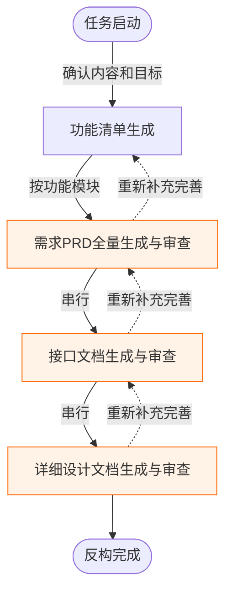

# 202605 AI自主反构百万级代码构建产品知识体系


## 目录
1. [背景与挑战](#1-背景与挑战)
2. [解决方案](#2-解决方案)
   - [2.1 文档分层划分核心逻辑](#21-文档分层划分核心逻辑)
   - [2.2 四类文档的生成逻辑](#22-四类文档的生成逻辑)
   - [2.3 四大文档生成详细实施路径](#23-四大文档生成详细实施路径)
3. [实践情况](#3-实践情况)
4. [总结](#4-总结)

---

## 1. 背景与挑战

在AI系统重构与全量代码生成的探索过程中，我们面临以下核心痛点与挑战：

1. **老系统缺乏标准化、体系化的配套文档**：想让AI自主完成需求开发，**体系化的知识建设是基石**。然而，部分老系统严重缺乏这类文档，靠纯人工建设需要投入大量人力，无法进行推广。
2. **全量反构人力成本极高**：2025年底我们实现了AI对代码的反构，但当时是基于**接口级**的反构。若要完成一个系统或者一个服务的全量反构，仍需投入大量人力。如果不能让AI以服务或系统为单位完成自主反构，该模式仍然很难进行规模化推广。

**结论**：基于以上现状，我们需要找到让AI以微服务、应用为单位自主完成反构的方法，将人力的投入降到最低。

---

## 2. 解决方案

### 2.1 文档分层划分核心逻辑

为了实现完整系统的自主反构，我们将系统知识划分为四层文档体系，由浅入深、由表及里，覆盖**业务全景 - 业务规则 - 数据交互 - 底层实现**全链路：

*   **第一层：宏观业务层（系统功能清单）**：站在产品全局视角，梳理系统全部功能模块，搭建系统全景框架。
*   **第二层：业务逻辑层（功能需求文档）**：聚焦单个功能，拆解业务规则、使用场景、业务流程。
*   **第三层：交互通信层（接口文档）**：打通前后端、服务之间的数据交互链路，明确数据传输规则。
*   **第四层：底层技术层（详细设计文档）**：拆解技术实现逻辑、算法规则、数据存储、依赖关系。

该四层体系既满足人与AI做需求分析的需要，也为后续AI自主完成设计和编码打下坚实基础。

---

### 2.2 四类文档的生成逻辑

```mermaid
flowchart TD
    subgraph 1. 系统功能清单生成逻辑
        A1([起始]) --> B1[导出UPP菜单功能资源]
        B1 --> C1[结合前端代码梳理功能点]
        C1 --> D1[输出结构化系统功能清单]
    end

    subgraph 2. 功能需求文档生成逻辑
        A2([起始]) --> B2[引用系统功能清单]
        B2 --> C2[逐个功能点匹配后端接口]
        C2 --> D2[从接口出发往下分析，梳理需求描述]
        D2 --> E2[输出功能需求文档]
    end

    subgraph 3. 接口文档生成逻辑
        A3([起始]) --> B3[遍历后端所有接口]
        B3 --> C3[解析请求与返回参数及字段信息]
        C3 --> D3[按照接口模板填充]
        D3 --> E3[输出接口文档]
    end

    subgraph 4. 详细设计文档生成逻辑
        A4([起始]) --> B4[切入后端代码层]
        B4 --> C4[层层分析，拆解逻辑、规则与存储信息]
        C4 --> D4[整合汇总]
        D4 --> E4[输出详细设计文档]
    end
```



1.  **系统功能清单的生成逻辑**：依托于业务运营的系统权限控制都需要在 UPP 配置。我们将 UPP 菜单功能资源导出，并结合前端代码梳理每个功能对应页面上的功能点，最终输出结构化系统功能清单。
2.  **功能需求文档的生成逻辑**：根据生成的系统功能清单逐个功能点，从前端代码出发，寻找每一个功能点对应后端代码的接口，并从接口出发层层往下分析，从需求描述的角度梳理整个功能的需求说明文档。
3.  **接口文档的生成逻辑**：从后端代码层出发，遍历并梳理每一个接口，提取请求参数、对应的对象以及字段的类型、描述信息等，再根据方法返回值解析输出格式，最终按接口模板填充输出。
4.  **详细设计文档的生成逻辑**：从后端代码层切入并层层往下分析，提取详细逻辑、规则、数据存储、依赖关系以及常量和变量等信息，汇总整理为详细设计文档。

---

### 2.3 四大文档生成详细实施路径

#### A. 系统功能清单生成
首先从 UPP 导出系统资源配置信息，精准提取系统一至四级菜单结构，明确各级菜单的层级关系及最后一级菜单包含的所有具体功能点；在此基础上，结合系统源代码进行深度梳理、补充和校验，厘清各功能点的关联关系与边界，最终依据 `feature-list-generation-rules_v1` 规则，生成完整、规范的系统功能清单。

*   **文档结构与示例**：
    *   **一级目录节点**：如“质量与EHS”
    *   **二级目录节点**：如“工单管理”、“整改管理”、“模板管理”
    *   **系统功能**：如“工单新建/编辑”、“工单审核”
        *   *列表页功能*：查询/筛选（工单号、项目、审核状态等）、列表显示（工单号、项目等）、操作（审核、详情、转发等）
        *   *审批页功能*：待审核列表、审核通过、审核驳回、意见等
    *   **子功能**：如“审批页操作”

#### B. 需求文档生成
以生成的系统功能清单为核心依托，针对清单中的每一个功能点，以系统代码库为核心知识来源，严格按照预设规则逐点生成对应需求文档；同时引入标准化检查规则，对生成的每一份需求文档进行合规性校验。

*   **文档结构**：
    *   **业务概述**：业务术语表、版本变更要点
    *   **页面与功能地图**：页面清单、页面内功能点清单、角色-操作权限矩阵
    *   **业务流程**：主流程（进入页面到关键操作）、子流程（如：新增、编辑、启用、关注/取消关注等）、异常流程（校验失败、接口失败、权限不足、并发冲突等）
    *   **业务功能需求**：场景覆盖规则、场景描述、角色/权限、操作入口、前端交互步骤、数据项描述、接口调用说明、业务校验规则、提示语（中英文）、验收准则（Given/When/Then）

#### C. 接口文档生成
按照接口方法层级逐步剥离拆解，深入梳理接口的请求方式、参数传递、返回逻辑等核心信息；接口相关字段信息直接从 model 对象中提取，确保字段名称、数据类型、约束条件与代码完全一致。

*   **文档结构**：
    *   **基本信息**：接口名称、接口说明、调用方
    *   **输入参数**：通用请求头、URL/Path 参数、请求消息体（展开字段说明）
    *   **输出参数**：Response 顶层结构、状态与消息结构 (ServiceCode)、业务对象 (bo)
    *   **调用实例**：
        *   *请求示例*：`POST /workOrder/acceptance/structure/draft HTTP/1.1`
        *   *响应示例*：`{"code": "0000", "bo": null, "msg": "success"}`
    *   **错误编码**

#### D. 详细设计文档生成
对每一个接口方法、业务流程进行层层拆解和深度分析，全面梳理代码中的常量定义、业务规则、逻辑分支、异常处理等核心内容。

*   **文档结构**：
    *   **需求映射** 与 **代码增量清单**（如：共 22 个 Controller，约 80+ 接口）
    *   **数据模型**：DTO/实体、跨服务 DTO、存量表复用、编码规范
    *   **接口设计**：流程配置接口、问题管理接口、跨服务 Feign/HTTP/RPC 接口等
    *   **业务规划与校验**：管理规则、流程规则、问题管理规则、字段校验规则
    *   **核心业务链路（创建链路）**：参与方、数据流向、事务边界、关键决策、处理逻辑
    *   **参数、常量与配置**：枚举定义、常量定义、国际化词条
    *   **单元测试**

---

## 3. 实践情况

### 3.1 总体流程（4步闭环 + 质量闸门）
系统已实现最大一次性完成 **80个微服务** 的反构。每一步都有明确的输入/输出和质量闸门，所有闸门都通过后才算完成。



*   **演示视频**：[epm知识.mp4](file:///d:/Users/10265696/Documents/AI%20Transformation/Skill/agent-team-workflow/reference-docs/epm知识.mp4)

---

### 3.2 多智能体协同任务执行 (Agent Team)
整个反构过程由创建 Agent Team 来分批完成。由于任务量巨大（约 23 个子模块 × 多阶段），我们构建了 Team 和任务列表分批次执行。

#### 任务批次示例（控制台输出）：
```text
* Nesting... [2m 20s - 1.5k tokens]
| 0阶段 1: PRD 生成 (批次 B: 工单域 07-13)
| 0阶段 1: PRD 生成 (批次 C: 基础能力域+横切能力 14-23)
| 0阶段 6: 接口文档审查 (全部子模块)
| 0阶段 6: 接口文档审查 (全部子模块)
| 0阶段 8: 设计文档审查 (全部子模块)
| 0阶段 8: 设计文档审查 (全部子模块)
| 0阶段 1: PRD 生成 (批次 A: 交付域 01-06)
| 0阶段 2: PRD 审查 (全部子模块)
| 0阶段 0: 功能清单确认与更新
+ 1 pending
```

---

### 3.3 详细实现规则与路径

#### 【代码与规则路径】
*   **代码根路径**：`C:/Users/10240008/zhixu-code-ws/zhiliang/code`
*   **功能清单规则**：`D:/EPM研发标杆/claude-code-main/commands/new/feature-list-generation-rules_v1.md`
*   **PRD生成规则**：`D:/EPM研发标杆/claude-code-main/commands/new/frontend-brd-generation_v2.md` *(含 §9.1 与《需求测试准入 DoD》对齐；定稿前自检)*
*   **PRD审查规则**：`D:/EPM研发标杆/claude-code-main/commands/new/frontend-brd-completeness-check_v2.md` *(执行 §2.19 与 xuqiuceshidod 对账并给出准入结论：通过/有条件通过/不准入)*
*   **测试准入标准**：`D:/EPM研发标杆/claude-code-main/commands/new/xuqiuceshidod.md` *(理解即可；落点在 PRD 审查)*
*   **接口文档生成规则**：`D:/EPM研发标杆/claude-code-main/commands/new/api-doc-generation-rules_v1.md`
*   **接口文档审查规则**：`D:/EPM研发标杆/claude-code-main/commands/new/api-doc-reconstruction-review-rules_v1.md`
*   **设计文档生成规则**：`D:/EPM研发标杆/claude-code-main/commands/new/design-doc-reconstruction-rules_v4.md`
*   **设计文档检查规则**：`D:/EPM研发标杆/claude-code-main/commands/new/design-doc-reconstruction-checker_v4.md`

#### 【输出目标目录】
目标基准目录：`C:/Users/10240008/zhixu-code-ws/iepmszhiliang`
*   **功能清单**：`{根}/knowledge/功能清单.md`
*   **PRD 与审查报告**：`{根}/knowledge/micro/{微服务名称}/prd-docs/` 和 `prd-review/`
*   **接口文档与审查报告**：`{根}/knowledge/micro/{微服务名称}/api-docs/` 和 `api-review/`
*   **设计文档与审查报告**：`{根}/knowledge/micro/{微服务名称}/design-docs/` 和 `design-review/`

---

### 3.4 阶段式执行详情

| 阶段 | 核心任务 | 说明与约束 | 输出文件命名样例 |
| :--- | :--- | :--- | :--- |
| **阶段 0** | **功能清单确认与更新** | 从代码出发，按 `feature-list-generation-rules_v1` 生成或更新，需与代码/菜单/路由对齐。 | `{根}/功能清单.md` |
| **阶段 1** | **PRD 生成** | 以功能清单中的业务域、模块与可验收能力为真源。按模块顺序连续编号，执行可测试性自检。 | `{根}/.../prd-docs/00_{模块短名}_{子模块短名}_业务需求文档.md` |
| **阶段 2** | **PRD 审查与迭代** | 按 `frontend-brd-completeness-check_v2` 审查（含测试准入对账）。不通过则重新修订并重新审查。 | `{根}/.../prd-review/00_{模块短名}_{子模块短名}_业务需求文档检查报告.md` |
| **阶段 3** | **接口文档生成** | PRD 审查通过后串行触发，按 `api-doc-generation-rules_v1` 生成。 | `{根}/.../api-docs/00_{模块短名}_{子模块短名}_接口文档.md` |
| **阶段 4** | **接口审查与迭代** | 执行接口文档检查。不通过则修订并重新审查，直至通过。 | `{根}/.../api-review/00_{模块短名}_{子模块短名}_接口检查文档.md` |
| **阶段 5** | **设计文档生成** | 按 `design-doc-reconstruction-rules_v4` 生成详细设计文档。 | `{根}/.../design-docs/00_{模块短名}_设计文档.md` |
| **阶段 6** | **设计审查与迭代** | 按 `design-doc-reconstruction-checker_v4` 审查。必须总体通过才可闭环。 | `{根}/.../design-review/00_{模块短名}_设计检查文档.md` |

> [!IMPORTANT]
> **串行约束**：子模块较多时可分批，但在同一会话内保持顺序与编号一致；每完成一个模块再进入下一个模块，避免并行导致编号出错。

---

## 4. 总结

本次系统代码反构工作采用**多智能体协同模式**。我们针对反构全流程各阶段，输出了标准化、规范化的规则文档，形成了可复用、可推广的反构实施标准，驱动各阶段智能体严格按照规则阅读、解析物理代码，深度梳理代码中的业务知识，最终实现系统需求的体系化构建。

### 4.1 落地成效

目前反构的文档已达到甚至超过优秀规划/优秀 BA 输出的文档，颗粒度齐平，**基本已超出 60% 以上的人工规划/BA 输出**。

*   **实施规模统计**：

| 产品名称 | 代码量 | 反构微服务数量 |
| :--- | :--- | :--- |
| **epm** | 150万+ | 老系统（前端+后台） |
| **ASMS** | 50万+ | 1个微服务 + 1个前端服务 |
| **采购** | 50万+ | 2个微服务 + 1个前端服务 |
| **iepms** | 1000万+ | 55个后台 + 25个前端服务 |

---